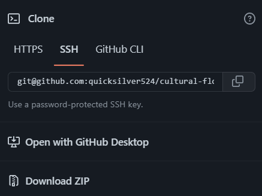
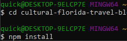
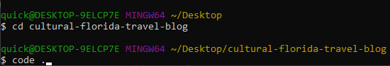

# Cultural-Florida-Travel-Blog

## Description

This is a front and backend for a blog site to share different cultural areas in Florida for fun and unique destinations for people who want to explore what Florida has to offer that can be fun and new even to Floridians. We provide restaurants, vacation spots, cutural evants/gathering festivals, and historical destinations to visit and learn more about Florida and its unique cultural residents. We provide website access to aid with your research and location data to guide you to expanding your cultural experiences.

## Table of Contents

- [Installation](#installation)
- [Usage](#usage)
- [Walkthrough-Video](#Walkthrough-Video)
- [Instructions](#instructions)
- [Step-10-website-heroku-deployment](#Step-10-website-heroku-deployment)
- [Created by](#Created-by)
- [Questions](#questions)

## Walkthrough-Video
https://user-images.githubusercontent.com/102430476/181919810-80397db9-48e9-4f8d-98a0-8f902e37f4c7.mp4

## Installation

In order to install this project you must clone this project on to your local machine.

## Usage

This project is developed to improve learning about Florida and its many unique destinations that could be utilized as a skeleton to any State or Country desiring to simplify communication of their many unique destinations.

## Instructions

- Step 1: Clone this repository

* 

- Step 2: Install dependencies with 'npm install'

* 

- Step 3: Type code .

* 

- Step 4: Create .env file

- Step 5: Add credentials using DB_NAME = 'cultural_florida_db', DB_USER, DB_PW

* 

- Step 6: Login to you mysql server and type 'source db/schema.sql

* 

- Step 7: (Optional!) Type 'npm run seed' to create a preset of categories, tags, and products

* 

- Step 8: Type 'npm start' once more to start the server

* 

- Step 9: Open Insomnia

* 

## Step-10-website-heroku-deployment 
 - You can create, edit, and delete your posts; upvote, leave comments, login, signup, and logout.
    you can only comment if logged in but you can view comments from those who previously commented without loging in. Only the admin and the user can modify posts and     comments after posted.
    
  [To view our page](https://calm-eyrie-85145.herokuapp.com/)
  [Youtube Channel](https://www.youtube.com/watch?v=LcHGuvC_Y4o)

## Created-by

[Jeremy](https://github.com/quicksilver524) - 

[Lindsey](https://github.com/LindseyHsiao) - 

[Mateo](https://github.com/MateoCapx) - 

[Lepeng Z.](https://github.com/goforward-z) - 

[Carly](https://github.com/cdonais) - 

## Questions

If you have any further questions please feel free to contact us at [quicksilver524@gmail.com](quicksilver524@gmail.com)
If you have any further questions please feel free to contact us at [zlepeng@yahoo.com](zlepeng@yahoo.com)
